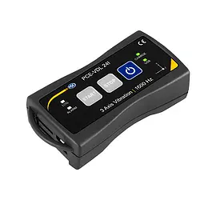

## Problem statement

Export Control is all about making sure you don't ship the wrong product to the wrong person and end up in prison. Various governments (aka "Jurisdictions") publish documentation on what you're allowed to do, and you're responsible for not violating those rules. One example is the US government Beureau of Industry and Security's [Export Administration Regulations](https://www.bis.doc.gov/index.php/regulations/export-administration-regulations-ear) (EAR).

For example, if you sell a product classified as [7A001](https://www.bis.doc.gov/index.php/documents/regulations-docs/2339-category-7-navigation-and-avionics-2/file) (Acclerometers as follows), it is controlled for National Security (NS), Missile Tech (MT), and Anti-Terrorism (AT). According to the [Commerce Country Chart](https://www.bis.doc.gov/index.php/documents/regulations-docs/federal-register-notices/federal-register-2014/1033-738-supp-1/file), that means you can't ship this product to Egypt without a special government license due to the NS and MT restrictions. 

So if you are [PCE Instruments](https://www.pce-instruments.com/us/) and you make an accelerometer data logger like [this one](https://www.pce-instruments.com/us/measuring-instruments/test-meters/data-logger-data-logging-instrument-pce-instruments-accelerometer-data-logger-pce-vdl-24i-3-axis-det_5857584.htm), you had better not ship one to Egypt or you'll end up on some very bad lists.

### Challenge

One of the hardest things for companies to do is understand and keep up with this documentation. For instance, categories 0-9 alone are a [520-page PDF](https://www.bis.doc.gov/index.php/documents/regulations-docs/2330-ccl0-to-9-10-24-18/file) of legal jargon. So pretend you're PCE Industries and have just designed this product. How do you figure out how to classify it according to the US EAR? Once you've figured that out, then you can classify under ITAR, and under the Waasenaar arrangement, and under... well, you get the idea. A lot of governments want to vote on who can do what.

### Large Language Models

Previously there was no good way to search that government documentation, since any keyword you may use could miss a valid regulation and land you in prison. Instead, you would have humans (export control compliance officers) spend their time keeping track of the regulations and doing things manually.

Large Language Models provide a unique opportunity to drastically improve this experience. Since LLM's can understand the meaning of text, not just look for specific words, we can ask them to figure out which classifications for a given product seem to make the most sense. We still need a human making the final decision, since often a company will "interpret" the regulations to align with their businesses.

### Tools Available

1. https://chat.openai.com/chat
   (Note, this is sometimes overloaded, so not always available)
2. http://waitlistapplication.azurewebsites.net/GPT
   (Each call here costs me money, so be nice)
3. C# GptPlayground app (hands-on/GptPlayground) with key provided in class
4. Postman or tool of your choice with key provided in class

### Data Available

1. bis.json
   (JSON file containing 520 pages of PDF extracted to JSON)
2. bis.pdf
   (The original 520 page PDF from the US government)
3. ProductExamples.txt
   (Four real-world products that should be classified under US EAR, courtesy of ChatGPT)

### Example we want it to predict

[Kongsberg MGC-R3 Magnetic Gyrocompasse](https://www.kongsberg.com/globalassets/maritime/km-products/product-documents/mgc-r3-gyro-compass-and-ins), classified in the US as 7A994.

Name: MGC-R3 Gyro Compass and ISN
Manufacturer: Kongsberg
Description: 

The MGC R3 product is a fully inertial navigation system 
(INS). It can output heading, roll, pitch, heave and 
position. Acceleration and velocity of linear motions, as 
well as angular rates, are output from the unit. The MGC 
R3 product outputs both processed and raw (gyro and 
accelerometer) sensor data.

The MGC R3 product can be used as a stand-alone unit 
or as an IMU in other systems. The product is designed 
for high precision maritime applications such as offshore 
operations and seabed mapping

• 0.01° roll and pitch accuracy
• 0.04° heading accuracy GNSS aided
• Includes INS capability
• Outputs on RS-232, RS-422 and Ethernet
• High output data rate (200 Hz)
• Precise heave at long wave periods by use of PFreeHeave® algorithms
• Lever arm compensation to two individually configurable monitoring points
• Small size and low power consumption
• Each MGC delivered with a Calibration Certificate
• Selectable communication protocols in the Windows based configuration software

### To make it difficult

Usually there are multiple different codes which could be selected. We want to ask the user questions which help narrow things down, and get better results over time.

The LLM already knows about old and out of date information. We want it to instead focus upon the ECCN data that we pass it directly.